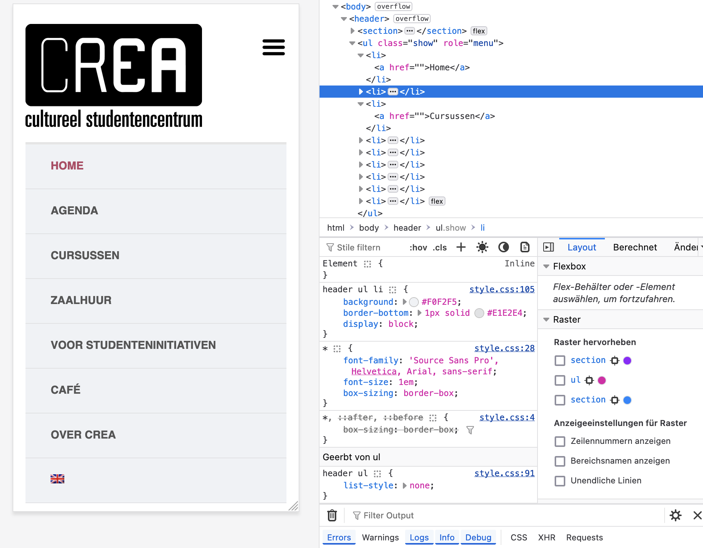
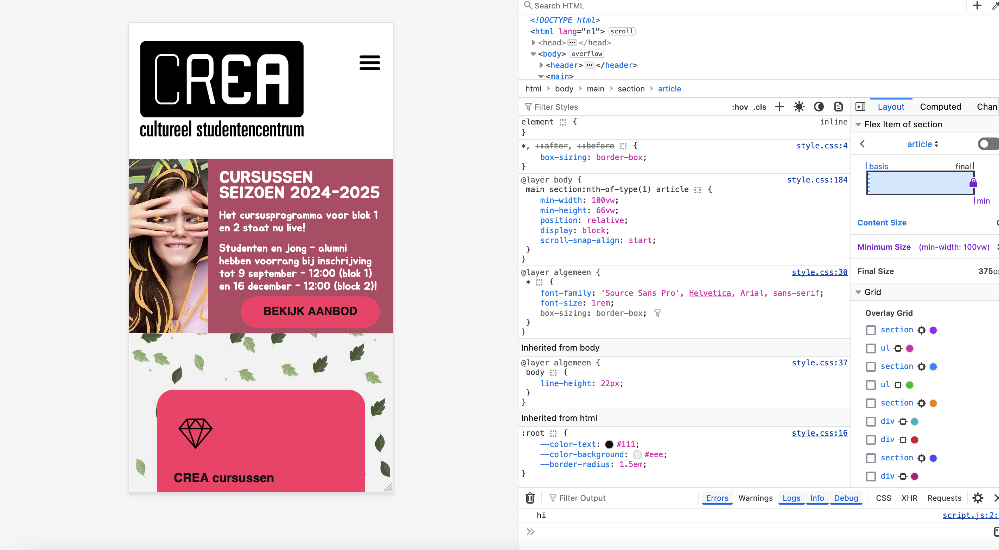

# Procesverslag
Markdown is een simpele manier om HTML te schrijven.  
Markdown cheat cheet: [Hulp bij het schrijven van Markdown](https://github.com/adam-p/markdown-here/wiki/Markdown-Cheatsheet).

Nb. De standaardstructuur en de spartaanse opmaak van de README.md zijn helemaal prima. Het gaat om de inhoud van je procesverslag. Besteedt de tijd voor pracht en praal aan je website.

Nb. Door *open* toe te voegen aan een *details* element kun je deze standaard open zetten. Fijn om dat steeds voor de relevante stuk(ken) te doen.

## Jij

  
uitwerken voor kick-off werkgroep

  ### Auteur:
  Maja (vervangen door jouw naam)

  #### Je startniveau:
  Zwart

  #### Je focus:
  Responsive
 

## Je website

  
uitwerken voor kick-off werkgroep

  ### Je opdracht:
  https://www.crea.nl/
  https://ginchanah.github.io/Crea-Website/

  #### Screenshot(s) van de eerste pagina (small screen): 
  Crea.nl 
  
  
  

  #### Screenshot(s) van de tweede pagina (small screen):
  hier de naam van de pagina  
  
  
 

## Toegankelijkheidstest 1/2 (week 1)

  
uitwerken na test in 2e werkgroep

  ### Bevindingen
  Lijst met je bevindingen die in de test naar voren kwamen:
  Website Sabrina: Mojo.nl

  De afbeeldingen hebben geen goede naam,
  Ik blijf hangen in de navigatie lijst
  Soms zeggen ze "link" en "clickable" maar het is niet clickable, ik kom niet verder
  "Item was removed" ik weet niet wat geselecteerd was
  ik blijf hangen in een group, hij zegt dat ik eruit ben maar ik kom nog steeds niet verder
  als ik headers laat voorlezen krijg ik allemaal namen die nergens op slaan, geen idee wat er staat op die website
  het is onmogelijk om op de knop te komen waar je een kaartje moet kopen

  ### Fotos van WCAG checklist website Crea
  
  
  
  
  

  Ik moet vooral aan de slag met kleuren, controls en images verbeteren.

## Breakdownschets (week 1)

  
uitwerken na afloop 3e werkgroep

  ### de hele pagina: 
  

  ### dynamisch deel: Filter
  

  ### wellicht nog een dynamisch deel: Hamburger menu 
  

## Voortgang 1 (week 2)

  
uitwerken voor 1e voortgang

  ### Stand van zaken
  Ik heb de body eerst een margin van 1 gegeven maar daarom moest ik, om de hele pagina in te vullen, de eerste section een margin van -1 geven, en duurde heel lang voordat de styling er goed in zat. Waarschijnlijk moet ik de margin van de body aanpassen en dan ook nog de section veranderen maar ik heb er al zo veel tijd aan besteed dat ik dat nu lastig vindt. Verder moet ik vooral verder met styling van de rest van de pagina. 
  De eerste section geeft in de originele pagina de tekst via een image weer, maar dat moet anderes, dus ik moet daarvoor nog een betere vormgeving verzinnen.

  

  De header is nu nog niet responsive genoeg, moet nog beter voor desktop formaat.

  

  ### Agenda voor meeting
  samen met je groepje opstellen

  | student 1      | student 2          | student 3    | student 4        |
  | ---            | ---                | ---          | ---              |
  | dit bespreken  | en dit             | en ik dit    | en dan ik dat    |
  | en dat ook nog | dit als er tijd is | nog een punt | dit wil ik zeker |
  | ...            | ...                | ...          | ...              |

  Niet gedaan!

  ### Verslag van meeting
  hier na afloop snel de uitkomsten van de meeting vastleggen

  - ik ben nog niet heel goed op weg, ik heb alleen maar styling van de header en de eerste section
  -margin van de body aanpassen
  -styling van de eerste section veranderen
  -vormgeving van section 1 aanpassen en mooier maken
  -header responsive maken

## Voortgang 2 (week 3)

  
uitwerken voor 2e voortgang

  ### Stand van zaken
  De styling van de eerste section is nu wel beter maar nog niet goed. Ik ga dit tot het laaste moment uitstellen omdat ik niet echt verder kom omdat ik alleen maar hieraan werk en niet weet hoe ik dat goed kan doen.

  De styling is nu wel veranderd en de body heeft een margin van 0 zodat ik geen margin: -1 voor de andere elementen moet gebruiken.

   

   Ik heb het menu gemaakt en hover states toegevoegd, die een betere contrast hebben dan de originele website.

   

   Ik heb nu ook een responsive grid voor de tweede section en beter kleurcontrast. 

   

   De derde section is nu ook in een responsive grid en beter kleurcontrast. Ik ben vooral trotz erop dat het image altijd binnen de verhoudingen van de figure blijft.

   

   

   verder moet ik vooral alles nog aanpassen en verder uitwerken, zoals bij section 4.

    
  

  ### Agenda voor meeting
  samen met je groepje opstellen

  | student 1      | student 2          | student 3    | student 4        |
  | ---            | ---                | ---          | ---              |
  | dit bespreken  | en dit             | en ik dit    | en dan ik dat    |
  | en dat ook nog | dit als er tijd is | nog een punt | dit wil ik zeker |
  | ...            | ...                | ...          | ...              |
 
 Niet gedaan!

  ### Verslag van meeting
  hier na afloop snel de uitkomsten van de meeting vastleggen

  - de vierde section uitwerken
  - de rest van de pagina afmaken
  - meer focus leggen of responsiveness en dat nog verder afmaken
- ...

## Toegankelijkheidstest 2/2 (week 4)

  
uitwerken na test in 9e werkgroep

  ### Bevindingen
  Lijst met je bevindingen die in de test naar voren kwamen (geef ook aan wat er verbeterd is):

## Voortgang 3 (week 4)

  
uitwerken voor 3e voortgang

  ### Stand van zaken

  Ik heb nu eindelijk mijn eerste section gefixt met de scrollable articles erin, want ik vond ze zelf eerst heel moeilijk om vorm te geven maar ik heb nu een oplossing gevonden door de div met de tekst erin een achtergrond te geven.

  

  Ook heb ik eindelijk de laastste section en de footer uitgewerkt.

  

  Nu moet ik vooral aan de slag met de responsiveness. Ik moet nog een aantal media queries aanmaken om vooral de menu als menu-balk weer te geven in plaats van een hamburger menu. Ook moet alles als het groter wordt gewoon nog een beetje mooier zijn.

  

  En er zijn natuurlijk ook nog een aantal dingen van de WCAG checklist die ik nog in mijn website moet toepassen.

  ### Agenda voor meeting
  samen met je groepje opstellen

  | student 1      | student 2          | student 3    | student 4        |
  | ---            | ---                | ---          | ---              |
  | dit bespreken  | en dit             | en ik dit    | en dan ik dat    |
  | en dat ook nog | dit als er tijd is | nog een punt | dit wil ik zeker |
  | ...            | ...                | ...          | ...              |

  Niet gedaan! 

  ### Verslag van meeting
  hier na afloop snel de uitkomsten van de meeting vastleggen

  - media queries toevoegen
  - website mooier maken
  - alles op responsiveness testen
  - WCAG checklist punten toepassen

## Eindgesprek (week 5)

  
uitwerken voor eindgesprek

  ### Je uitkomst - karakteristiek screenshots:
  

  ### Dit ging goed/Heb ik geleerd: 
  Korte omschrijving met plaatjes

  

  ### Dit was lastig/Is niet gelukt:
  Korte omschrijving met plaatjes

  

## Bronnenlijst

  
continu bijhouden terwijl je werkt

  Nb. Wees specifiek ('css-tricks' als bron is bijv. niet specifiek genoeg). 
  Nb. ChatGpT en andere AI horen er ook bij.
  Nb. Vermeld de bronnen ook in je code.

  1. bron 1
  2. bron 2
  3. ...

